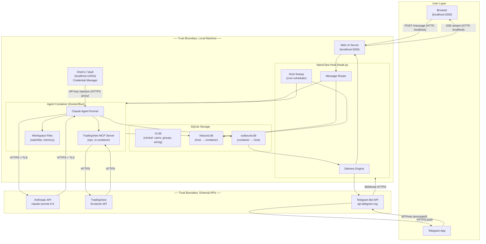

# AI Data Flows Privacy Audit: Privacy-Aware Trading Assistant

## 1. System Diagram

**Component Summary**

| Component | Location | Role |
|-----------|----------|------|
| Web UI | localhost:3200 | Browser-based chat interface |
| Telegram App | User device / Telegram servers | Mobile/desktop notification channel |
| NanoClaw Host | Local machine | Message routing, delivery, scheduling |
| Agent Container | Docker (local) | Runs Claude, processes queries |
| OneCLI Vault | localhost:10254 | Stores and injects API credentials |
| SQLite DBs | Local disk | Session state, message history |
| Anthropic API | External (US) | LLM inference (Claude) |
| TradingView API | External | Real-time stock prices, RSI, screener |
| Telegram Bot API | External (Telegram servers) | Message push to Telegram |

---

## 2. Data Flow Analysis

| # | Data Flow | Source | Destination | Data Transmitted | Encrypted? | Logged? | Priority |
|---|-----------|--------|-------------|-----------------|------------|---------|----------|
| 1 | User query via Web UI | Browser | NanoClaw (localhost:3200) | User's typed message | No (localhost HTTP) | Yes — inbound.db | Medium |
| 2 | Agent response via Web UI | NanoClaw | Browser | Agent's reply text | No (localhost SSE) | Yes — outbound.db | Medium |
| 3 | Message written to session DB | NanoClaw Host | inbound.db (local disk) | Full message + sender metadata + routing | No (local file) | This IS the log | Low |
| 4 | Container wake + DB mount | NanoClaw Host | Docker container | inbound.db file (via volume mount) | No (local) | No | Low |
| 5 | **Conversation → Anthropic API** | Agent container | Anthropic (external) | Full conversation history, system prompt, tool schemas | Yes (HTTPS/TLS) | Yes — Anthropic retains API logs | **High** |
| 6 | Claude response | Anthropic (external) | Agent container | AI-generated text + tool calls | Yes (HTTPS/TLS) | Yes — outbound.db | High |
| 7 | **Watchlist query → TradingView** | TradingView MCP (in-container) | TradingView API (external) | Ticker symbols (AAPL, NVDA, etc.) | Yes (HTTPS) | Unknown — TradingView's servers | **High** |
| 8 | Market data response | TradingView API | Agent container | Prices, RSI, volume, OHLCV | Yes (HTTPS) | Yes — agent workspace files | Medium |
| 9 | API key injection | OneCLI Vault | Agent container (via proxy) | Anthropic API key | Yes (HTTPS proxy) | Access log in OneCLI | High |
| 10 | **Briefing → Telegram Bot API** | NanoClaw Host | Telegram servers (external) | Formatted stock briefing text | Yes (HTTPS) | Yes — Telegram servers + nanoclaw.log | **High** |
| 11 | Telegram push to user | Telegram servers | User's Telegram app | Stock briefing message | Yes (MTProto) | Yes — Telegram retains messages | High |
| 12 | Inbound Telegram message | Telegram servers | NanoClaw webhook | User's Telegram message text | Yes (HTTPS webhook) | Yes — central DB + inbound.db | High |
| 13 | Scheduled task trigger | Host sweep (local) | inbound.db | Task prompt + schedule metadata | No (local SQLite) | Yes — inbound.db | Low |
| 14 | Agent memory write | Agent container | Workspace files (local) | Watchlist, conversation summaries | No (local file) | No | Low |
| 15 | Agent response → delivery | outbound.db | NanoClaw delivery engine | Agent reply text + routing | No (local file) | Yes — nanoclaw.log | Low |

---

## 3. Risk Areas

### HIGH — Conversation data sent to Anthropic (Flow #5)
Every message you send — and the agent's full conversation history — is transmitted to Anthropic's API servers for inference. This includes:
- Your stock watchlist and trading queries
- Any personal context you share with the agent

**Mitigation options:** Minimize PII in prompts; use Anthropic's [zero data retention policy](https://privacy.anthropic.com) via API (no training on API data by default); avoid including portfolio values or account details.

### HIGH — Watchlist exposed to TradingView (Flow #7)
The TradingView MCP server sends your ticker symbols to TradingView's screener API. TradingView can observe which stocks you're monitoring and when.

**Mitigation options:** Self-host a market data source (Alpha Vantage, Yahoo Finance); run the MCP server locally with a self-contained data feed.

### HIGH — Messages pass through Telegram servers (Flows #10–12)
All Telegram messages — both inbound commands and outbound briefings — transit Telegram's servers. Telegram can read message content (messages are not E2E encrypted by default in bot chats).

**Mitigation options:** Use a channel that stays fully local (Web UI only); switch to Signal (E2E encrypted) or iMessage.

### MEDIUM — No encryption on localhost data flows (Flows #1–4, #13–15)
Web UI uses plain HTTP (not HTTPS) on localhost. SQLite files on disk are unencrypted.

**Mitigation options:** Enable HTTPS on the Web UI with a self-signed cert; enable SQLite encryption (SQLCipher); rely on OS-level disk encryption (FileVault on macOS).

### MEDIUM — Anthropic and Telegram retain logs
Both Anthropic (API call logs) and Telegram (message history) retain data on their servers per their respective privacy policies.

**Mitigation options:** Review Anthropic's data retention settings in your account dashboard; set Telegram auto-delete on the bot chat.

---

## 4. Trust Boundary Summary

| Boundary | Inside | Outside |
|----------|--------|---------|
| Local machine | Web UI, NanoClaw Host, Agent Container, OneCLI Vault, SQLite DBs, Workspace files | Anthropic API, TradingView API, Telegram servers |
| Docker container | Agent runner, TradingView MCP server, Workspace mounts | NanoClaw Host (communicates only via SQLite files) |
| Credential scope | OneCLI Vault injects keys per-request | Agent never holds keys in memory between sessions |
