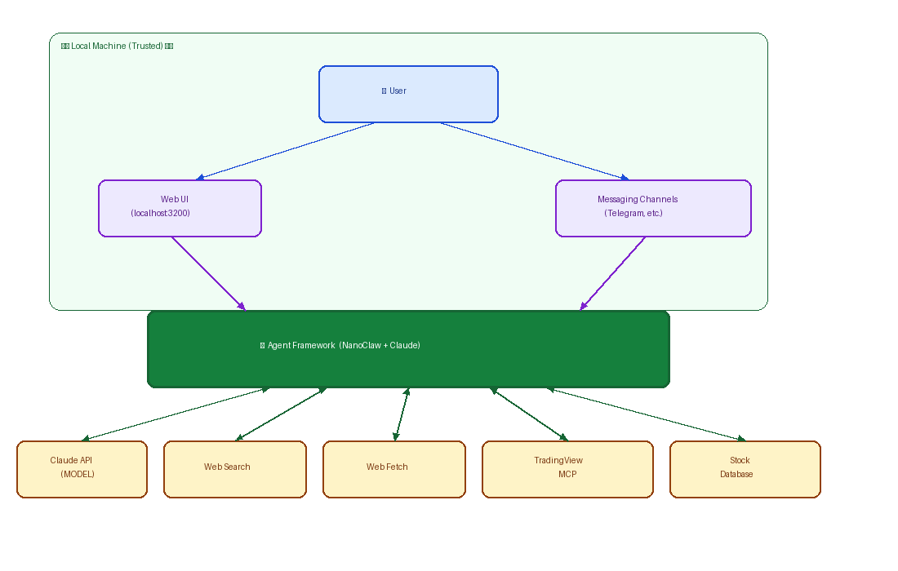

# Privacy-Aware Trading Assistant

Built as part of the **Practical AI Privacy** course.

A personal stock market assistant that delivers daily price briefings via Telegram, powered by [NanoClaw](https://nanoclaw.dev) — a self-hosted AI agent framework that runs Claude in isolated containers on your own machine. No data leaves your device except the API calls you explicitly configure.

## What It Does

- **Daily briefings at 9 AM and 3 PM PT (Mon–Fri)** — fetches live prices and RSI for your watchlist via TradingView and sends a formatted message to your Telegram DM
- **On-demand queries** — ask the agent anything via the Web UI (e.g. "What's the RSI on NVDA?", "Add TSLA to my watchlist")
- **Persistent memory** — the agent remembers your watchlist and preferences across sessions

## Privacy Properties

- The agent runs inside a Docker container on your local machine
- Credentials (Telegram bot token, Anthropic API key) are managed by [OneCLI](https://onecli.sh) — injected at runtime, never stored in the agent's context
- No conversation data is sent to third parties beyond the Claude API call itself
- The Web UI is local-only (`127.0.0.1`) — not exposed to the internet
- Market data comes from TradingView's screener API (no account credentials required)

## Architecture



| Zone | Components |
|------|-----------|
| **User** | Web UI (localhost:3200), Messaging Channels (Telegram) |
| **Agent Framework** | NanoClaw host + Claude agent container — the core processing layer |
| **Tools** | Claude API, Web Search, Web Fetch, TradingView MCP, Stock Database |

- **NanoClaw** routes messages between channels (Web UI, Telegram) and the agent container
- **Agent container** runs Claude with access to TradingView MCP tools
- **Two-DB session split** — host and container communicate only through SQLite files (no open ports between them)
- Full data flow audit: see [`DATA_FLOW_AUDIT.md`](DATA_FLOW_AUDIT.md)

## Key Files Added

| File | Purpose |
|------|---------|
| `src/channels/web-ui.ts` | Local Web UI channel adapter (SSE + HTTP) |
| `src/channels/telegram.ts` | Telegram bot channel adapter |
| `src/channels/telegram-pairing.ts` | Pairing flow (4-digit code to link a chat) |
| `src/channels/telegram-markdown-sanitize.ts` | Telegram-safe markdown formatter |
| `setup/pair-telegram.ts` | Setup step for pairing Telegram |
| `groups/main/CLAUDE.local.md` | Agent persona — trading assistant role, watchlist conventions, briefing format |
| `groups/main/container.json` | TradingView MCP server wired into the agent container |

## Setup

### Prerequisites
- macOS or Linux
- Docker
- Node.js 20+ and pnpm
- [NanoClaw v2](https://nanoclaw.dev) base install
- Anthropic API key
- Telegram bot token (from [@BotFather](https://t.me/BotFather))

### Steps

1. Clone and install NanoClaw v2 following the [official setup guide](https://docs.nanoclaw.dev)
2. Copy `.env.example` to `.env` and fill in your credentials
3. Run the Telegram pairing step:
   ```bash
   pnpm exec tsx setup/index.ts --step pair-telegram -- --intent main
   ```
4. Send the 4-digit code from your Telegram app to your bot
5. Start NanoClaw:
   ```bash
   launchctl load ~/Library/LaunchAgents/com.nanoclaw.plist
   ```
6. Open the Web UI at `http://localhost:3200` and ask the agent to set up your watchlist

### Watchlist

Edit `/groups/main/trading/watchlist.txt` (one ticker per line) or ask the agent:
> "Add GOOGL to my watchlist"

## Daily Briefing Format

```
📊 Daily Watchlist — May 4

AAPL   $280.14  +3.24%  ▲
NVDA   $875.20  -0.80%  ▼
MSFT   $415.30  +1.10%  ▲
TSLA   $242.10  +3.10%  ▲

Biggest mover: TSLA +3.10%
```

## Course Context

This project explores how to build a privacy-respecting AI assistant:

- **Local-first**: the agent runs on your hardware, not a cloud service
- **Minimal data exposure**: credentials are injected per-request via OneCLI vault, not stored in prompts or logs
- **Explicit channel control**: you decide which messaging platforms the agent can reach
- **Isolated execution**: each agent session runs in its own container with scoped filesystem access
